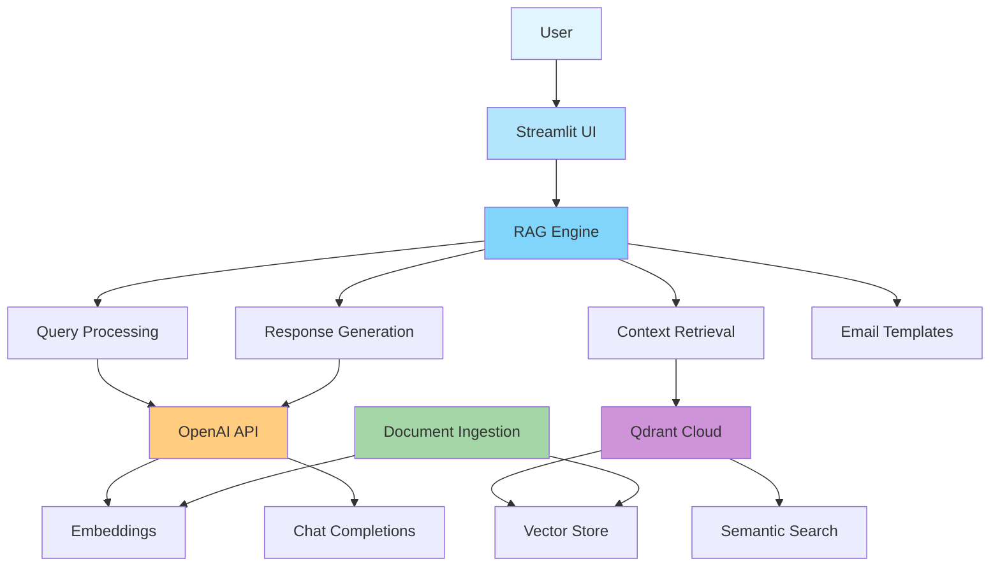
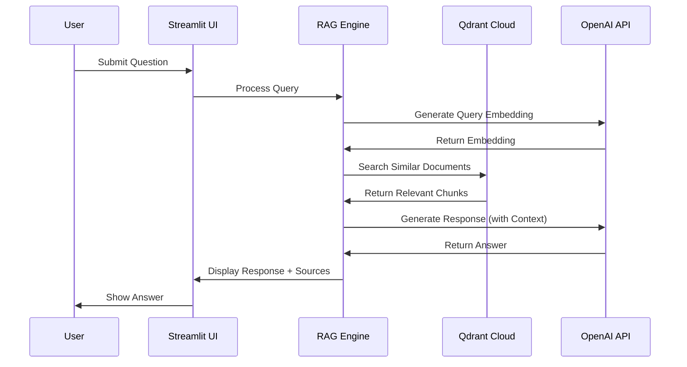
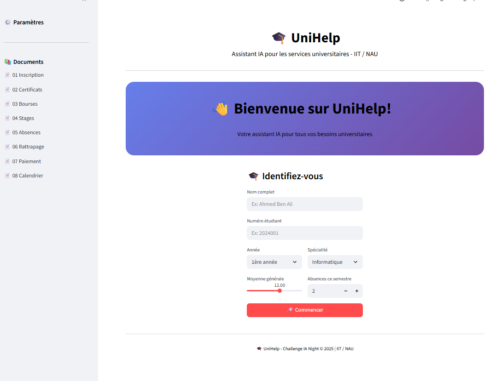
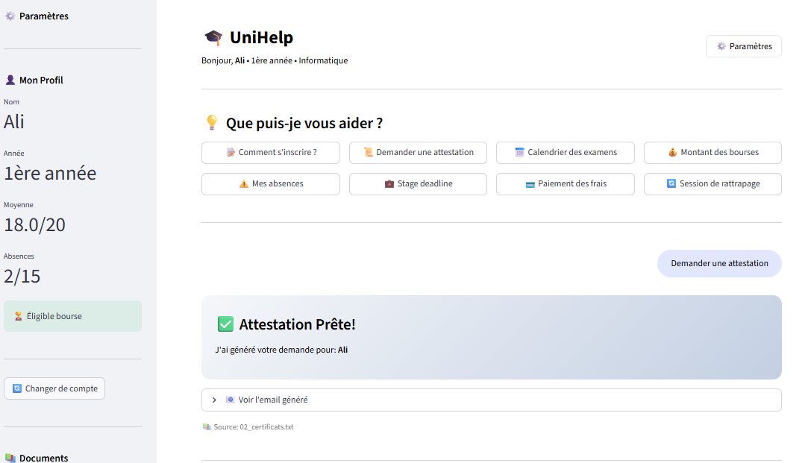
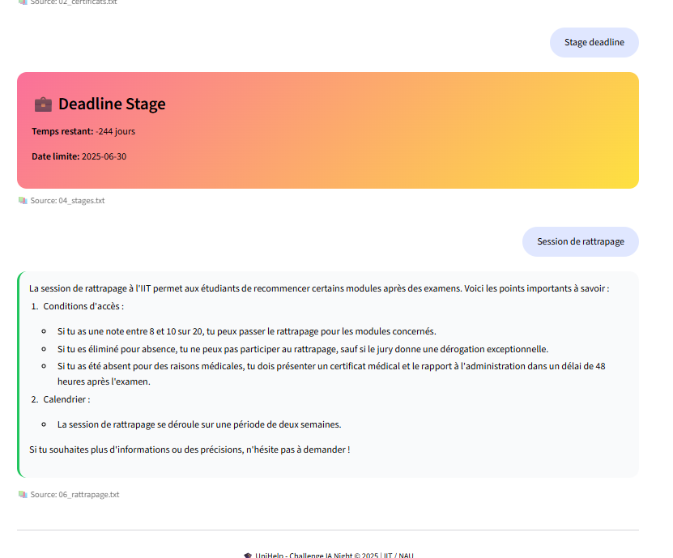
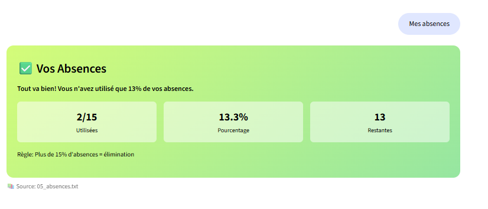

# UniHelp - Assistant IA pour Services Universitaires

## Overview

UniHelp is an intelligent assistant designed to help students navigate university services. By leveraging Retrieval-Augmented Generation (RAG) technology, UniHelp provides accurate, instant answers based on official university documents while maintaining consistency across all responses.

## Problem Statement

University students face daily challenges accessing information about:
- Registration and re-enrollment procedures
- Certificates and official documents
- Scholarships and financial aid
- Internships and conventions
- Attendance tracking
- Make-up exams
- Fee payments
- Academic calendar
- Internal regulations

Traditional administrative support is often overwhelmed, leading to delays and inconsistent information. UniHelp addresses these issues by providing instant, reliable responses based on official documentation.

## Solution

UniHelp combines document search with AI-generated responses to deliver:
- Centralized knowledge base from official university documents
- Instant responses to student questions 24/7
- Automatic generation of administrative emails
- Consistent information across all interactions

## Technical Architecture

### Core Technologies

- **Vector Database**: Qdrant Cloud for semantic search and document storage
- **Embeddings**: OpenAI text-embedding-3-small (1536 dimensions)
- **Language Model**: OpenAI gpt-4o-mini for response generation
- **Text Processing**: Chonkie framework for intelligent document chunking
- **User Interface**: Streamlit web application
- **Backend**: Python with REST API clients

### System Components



### Data Flow



### Ingestion Pipeline

```mermaid
flowchart LR
    A[PDF/TXT Documents] --> B[Document Extractor]
    B --> C[Text Chunker]
    C --> D[512 Token Chunks]

    D --> E[OpenAI Embeddings]
    E --> F[Vector Embeddings]

    F --> G[Qdrant Cloud]
    G --> H[Vector Database]

    style A fill:#ffcdd2
    style B fill:#f8bbd0
    style C fill:#e1bee7
    style E fill:#d1c4e9
    style G fill:#c5cae9
    style H fill:#bbdefb
```


### UI 









## Features

### Student Profile System
- Personalized login with student information
- GPA tracking and scholarship eligibility
- Attendance monitoring with visual progress
- Internship deadline countdown

### Quick Actions
- Registration procedures
- Certificate requests
- Exam calendar
- Scholarship information
- Attendance status
- Internship deadlines

### Intelligent Responses
- Context-aware answers based on official documents
- Source references for transparency
- Natural language processing in French and English

### Email Generation
- Automatic generation of administrative emails
- Templates for common requests (certificates, make-up exams, etc.)
- Professional formatting ready to send

## Installation

### Prerequisites
- Python 3.10+
- OpenAI API key
- Qdrant Cloud credentials

### Setup

1. Clone the repository
2. Install dependencies using uv:
   ```bash
   uv venv
   .venv/scripts/activate
   uv pip install -r requirements.txt
   ```

3. Configure environment variables in `.env`:
   ```
   OPENAI_API_KEY=your_openai_key
   QDRANT_URL=your_qdrant_url
   QDRANT_API_KEY=your_qdrant_key
   QDRANT_COLLECTION_NAME=unihelp_docs
   ```

4. Run the application:
   ```bash
   streamlit run app_premium.py
   ```

## Project Structure

```
assistant-univer/
├── Data/                   # University documents (TXT/PDF)
├── src/
│   ├── config.py          # Configuration management
│   ├── ingest.py          # Document ingestion pipeline
│   ├── pdf_extractor.py   # Text extraction from documents
│   ├── chunker.py         # Text chunking with Chonkie
│   ├── qdrant_rest.py     # Qdrant REST client
│   └── rag_engine.py      # RAG engine for Q&A
├── app_premium.py         # Main application (premium UI)
├── app.py                 # Main application (simple UI)
└── requirements.txt       # Python dependencies
```

## Configuration

- Chunk size: 512 tokens
- Chunk overlap: 50 tokens
- Embedding model: text-embedding-3-small (1536 dimensions)
- LLM model: gpt-4o-mini
- Retrieval limit: 5 documents per query

## Use Cases

### Example 1: Registration Query
User: "Comment s'inscrire?"
System retrieves registration procedures from documents and provides step-by-step instructions.

### Example 2: Certificate Request
User: "Demander une attestation"
System generates a formatted email with student details ready to send to administration.

### Example 3: Attendance Check
User: "Mes absences"
System displays current attendance status with visual progress bar and remaining allowed absences.

### Example 4: Scholarship Eligibility
User: "Montant des bourses"
System checks GPA and displays scholarship eligibility status with amount information.

## Documents

The `Data/` folder contains 9 university documents:
1. 01_inscription.txt - Registration procedures
2. 02_certificats.txt - Certificates guide
3. 03_bourses.txt - Scholarships information
4. 04_stages.txt - Internships guide
5. 05_absences.txt - Attendance rules
6. 06_rattrapage.txt - Makeup exams
7. 07_paiement.txt - Payment guide
8. 08_calendrier.txt - Academic calendar
9. 09_reglement.txt - Internal regulations

## Future Enhancements

- Multi-language support (Arabic, English)
- Integration with university database for real-time data
- Mobile application (React Native)
- Voice interface
- Document upload for custom queries
- Admin dashboard for analytics
